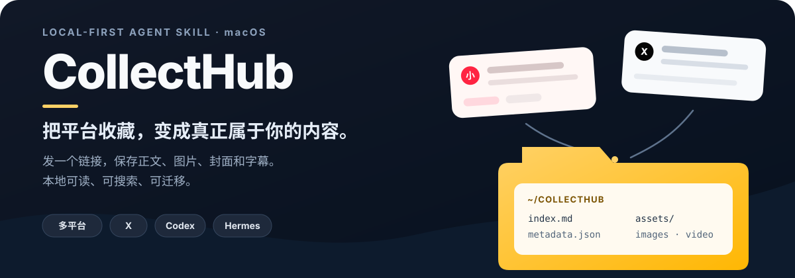
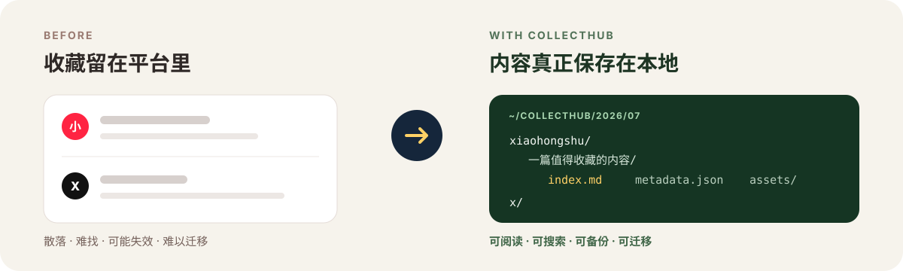

<p align="center">
  
</p>

<p align="center">
  <strong>不再把重要内容寄存在平台收藏夹里。</strong><br>
  将链接发给 Codex 或 Hermes，正文、图片、封面和字幕会整理成真正属于你的本地文件。
</p>

<p align="center">
  <a href="#快速开始">快速开始</a> ·
  <a href="#支持范围">支持范围</a> ·
  <a href="#notion同步">Notion 同步</a> ·
  <a href="#常用管理命令">管理命令</a>
</p>

## 01 · 收藏不是拥有

平台收藏适合“先放进去”，却不适合长期管理。内容散落在不同应用里，回头难找，原帖还可能删除、隐藏或受登录状态限制；想换一个知识管理工具时，也很难完整带走。

CollectHub 把已经成功保存的内容变成普通的 Markdown、JSON 和媒体文件。你可以直接阅读、全文搜索、备份到硬盘，或交给其他工具继续处理。

<p align="center">
  
</p>

## 02 · 发一个链接，留下完整内容

- **一句话收藏**：把小红书、X、知乎、YouTube、Reddit、Facebook、TikTok 或普通网页链接直接发给 Agent。
- **把分散内容收进一个地方**：保留正文、图片、封面、字幕、Live Photo、Long Post 和 Article。
- **真正本地拥有**：内容默认进入 `~/CollectHub`，不依赖某个云端服务才能打开。
- **自动整理与去重**：按年月和平台归档；重复链接不会制造多份副本。
- **批量也不中断**：一条消息可以包含多个链接，某一条失败不会影响后面的内容。
- **Notion 完全可选**：本地保存始终是主结果，需要时再显式同步到 Notion。

直接把链接或平台分享文本发给 Agent：

```text
帮我保存 https://www.xiaohongshu.com/explore/NOTE_ID
```

```text
收藏 https://x.com/username/status/TWEET_ID
```

```text
保存这篇文章 https://example.com/an-article
```

一条消息可以包含多个链接。某一条失败，不会阻断后面的内容。

<a id="快速开始"></a>

## 03 · 一分钟开始使用

CollectHub 首版支持 macOS（Apple Silicon 和 Intel），可安装到 Codex、Hermes 或两者。

```bash
curl --proto '=https' --tlsv1.2 -fsSL \
  https://raw.githubusercontent.com/suneveryday/CollectHub/v1.2.1/install.sh | sh
```

安装器会先说明将要安装的内容和写入位置，得到确认后才会继续。它使用独立运行环境，不会修改系统 Python。

安装完成后，重启 Codex 或开启新的 Hermes 会话，然后发送链接即可。裸链接、平台分享文本和同时包含多个链接的消息都可以直接处理。

## 04 · 本地内容与视频书签

所有成功采集的内容都会在 `~/CollectHub` 保留可去重和恢复的本地记录：

```text
~/CollectHub/
└── 2026/07/xiaohongshu/一篇值得收藏的内容--CONTENT_ID/
    ├── index.md       # 适合阅读和搜索的正文
    ├── metadata.json  # 来源、作者和保存信息
    └── assets/        # 图片、封面、字幕或来源允许保存的媒体
```

这些都是普通文件。你可以用 Finder 打开、用 Spotlight 或其他工具搜索，也可以按自己的方式同步和备份。

## 支持范围

| | 当前支持 |
|---|---|
| 内容平台 | 小红书、X / Twitter、知乎、YouTube、Reddit、Facebook、TikTok、公开 HTML 网页 |
| 内容类型 | 文字、图片、封面、字幕、视频元数据、Live Photo、长帖、Article、网页 |
| Agent | Codex、Hermes |
| 操作系统 | macOS arm64、macOS x86_64 |
| 保存位置 | 本地目录；明确要求时同步到 Notion |

CollectHub 专注于保存你提供的单条内容链接。YouTube、Reddit、Facebook 和 TikTok 的视频不下载视频或音频：本地只保留用于去重和恢复的小型元数据、封面与可用字幕；明确同步到 Notion 时，保存稳定的原内容页链接、标题、作者、简介、时长和封面。Reddit 支持单条文字、图片、外链和视频帖子，但不抓评论。普通网页只做静态提取，不运行脚本，也不处理登录墙、付费墙、验证码或 PDF。

它不提供账号批量抓取、频道/播放列表采集、平台搜索、登录绕过、AI 摘要、评论或内容发布。

<a id="notion同步"></a>

## 可选：同步到 Notion

Notion 默认关闭。只有在请求中明确说“同步到 Notion”，或使用下面的参数时才会写入：

```bash
content-ingestor ingest '<URL>' --sync notion
```

即使 Notion 同步失败，本地文件仍然会保留。仓库不包含任何个人 Notion 数据库 ID、Token 或 Cookie。

<details id="常用管理命令">
<summary><strong>常用管理命令</strong></summary>

检查安装：

```bash
content-ingestor doctor
```

预览安装内容：

```bash
curl -fsSL https://raw.githubusercontent.com/suneveryday/CollectHub/v1.2.1/install.sh | sh -s -- --dry-run
```

修复安装：

```bash
curl -fsSL https://raw.githubusercontent.com/suneveryday/CollectHub/v1.2.1/install.sh | sh -s -- --yes --repair
```

卸载程序：

```bash
curl -fsSL https://raw.githubusercontent.com/suneveryday/CollectHub/v1.2.1/install.sh | sh -s -- --yes --uninstall
```

卸载不会删除 `~/CollectHub` 中已经保存的内容。

</details>

## 隐私与使用说明

Cookie 和 Notion Token 只应保存在权限受限的本地文件或环境变量中，不要将它们发送到聊天或提交到仓库。可选平台 Cookie 位于 `~/.config/collecthub/cookies/<platform>.txt`，必须是当前用户拥有且权限为 `0600` 或更严格的 Netscape 文件。CollectHub 不会自动读取浏览器 Cookie，也不会把凭据写入收藏内容、日志或元数据。

请只保存自己有权访问和使用的内容，并遵守来源平台条款及适用法律。

## 开发与许可证

Skill 位于 [`skills/content-ingestor`](skills/content-ingestor)，遵循 [Agent Skills](https://agentskills.io) 开放规范。

CollectHub 使用 [MIT License](LICENSE)。第三方下载器作为独立程序安装和运行，详细许可信息见 [THIRD_PARTY_NOTICES.md](THIRD_PARTY_NOTICES.md)。
